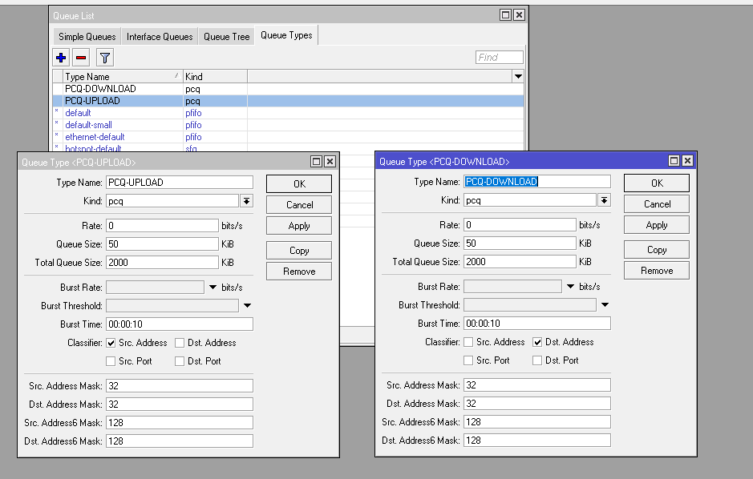

# LAB-29-PCQ-Configuration
tanggal 19 agustus 2025

# PCQ Configuration

# langkah langkah konfigurasi
1. buka mikrotik pilih menu QUEUES > queue types
2. klik (+)
3. buat 2 setting queue type, dengan ketentuan **kind** nya jadi **pcq**
4. pilih classifier **Dst Address untuk PCQ Download** dan **Src Address untuk PCQ Upload**

5. lalu buka simple queque, **queues > simple queue**
6. nama bebas, lalu masukan interface **target** .
7. masukkan max-limit upload, download 7m sesuai topologi

8. di bagian tab **advanced** ubah queue type target upload nya ke   
   PCQ-UPLOAD dan yang target download ke PCQ-DOWNLOAD.

9.klik ok

10. sudah beres dan bisa di cek di kedua PC secara bersamaan dengan mengecek traffic, seperti mengunakan speedtest.com atau semacamnya.
    
# kesimpulan
Konfigurasi PCQ (Per Connection Queue) pada Mikrotik bertujuan untuk membagi bandwidth internet secara adil dan merata ke setiap pengguna atau koneksi dalam jaringan. Dengan PCQ, setiap koneksi mendapatkan porsi bandwidth yang sama, mencegah satu pengguna mengambil alih sebagian besar bandwidth dan membuat koneksi lain menjadi lambat. 

# Sumber

Youtube - IDN - https://www.youtube.com/watch?v=-EOTmcZ9Kmg
